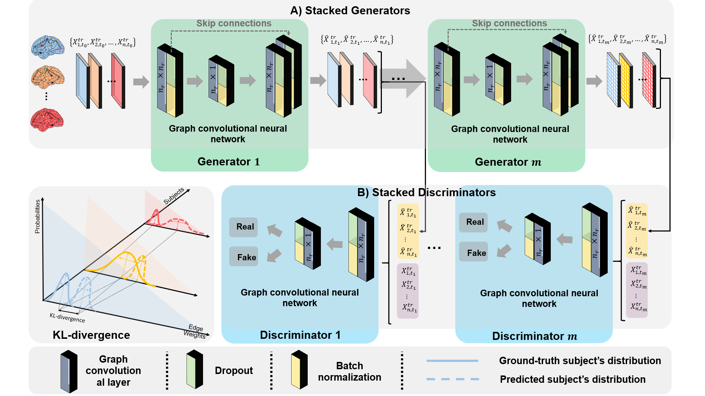

# EvoGraphNet
EvoGraphNet for joint prediction of brain connection evolution, coded up in Python by Uğur Ali Kaplan (uguralikaplan@gmail.com) and Ahmed Nebli (mr.ahmednebli@gmail.com).  

This repository provides the official PyTorch implementation of the following paper:



> **Deep EvoGraphNet Architecture For Time-Dependent Brain Graph Data Synthesis From a Single Timepoint**<br/>
> [Ahmed Nebli](https://github.com/ahmednebli)<sup>†1,2</sup>, [Uğur Ali Kaplan](https://github.com/UgurKap)<sup>†1</sup>, [Islem Rekik](https://basira-lab.com/)<sup>1</sup><br/>
> <sup>1</sup>BASIRA Lab, Faculty of Computer and Informatics, Istanbul Technical University, Istanbul, Turkey<br/>
> <sup>2</sup>National School for Computer Science (ENSI), Mannouba, Tunisia<br/>
> <sup>†</sup>Equal Contribution<br/>
>
> **Abstract:** *Learning how to predict the brain connectome (i.e. graph) development and aging is of paramount importance for charting the future of within-disorder and cross-disorder landscape of brain dysconnectivity evolution. Indeed, predicting the longitudinal (i.e., time-dependent) brain dysconnectivity as it emerges and evolves over time from a single timepoint can help design personalized treatments for disordered patients in a very early stage. Despite its significance, evolution models of the brain graph are largely overlooked in the literature. Here, we propose EvoGraphNet, the first end-to-end geometric deep learning powered graph-generative adversarial network (gGAN) for predicting time-dependent brain graph evolution from a single timepoint. Our EvoGraphNet architecture cascades a set of time-dependent gGANs, where each gGAN communicates its predicted brain graphs at a particular timepoint to train the next gGAN in the cascade at follow-up timepoint. Therefore, we obtain each next predicted timepoint by setting the output of each generator as the input of its successor which enables us to predict a given number of timepoints using only one single timepoint in an end-to-end fashion. At each timepoint, to better align the distribution of the predicted brain graphs with that of the ground-truth graphs, we further integrate an auxiliary Kullback-Leibler divergence loss function. To capture time-dependency between two consecutive observations, we impose an l1 loss to minimize the sparse distance between two serialized brain graphs. A series of benchmarks against variants and ablated versions of our EvoGraphNet showed that we can achieve the lowest brain graph evolution prediction error using a single baseline timepoint.*

## Dependencies
* [Python 3.8+](https://www.python.org/)
* [PyTorch 1.5.0+](http://pytorch.org/)
* [PyTorch Geometric 1.4.3+ and Relevant Packages](https://pytorch-geometric.readthedocs.io/en/latest/notes/installation.html)
* [Scikit-learn 0.23.0+](https://scikit-learn.org/stable/)
* [Matplotlib 3.1.3+](https://matplotlib.org/)
* [Numpy 1.18.1+](https://numpy.org/)

## Simulating Time-series data

To simulate longitudinal brain data, you can run the create_data.py code under "data" directory. It will create 113 random samples. 

```bash
python create_data.py
```

## Running EvoGraphNet

You can use the EvoGraphNet.py located under the "code" directory to run the model. To set the parameters, you should provide commandline arguments. 

You can run the program with the following command:

```bash
python EvoGraphNet.py --loss LS --epoch 500 --folds 5
```

In this example, we are using Least Squares as adversarial loss and training for 500 epochs in each of the 5 folds. If you want to run the code in the hyperparameters described in the paper, you can run it without any commandline arguments:

```bash
python EvoGraphNet.py
```

Other Commandline Arguments:

--lr_g: Generator learning rate  
--lr_d: Discriminator learning rate  
--loss: Which adversarial loss to use for training, choices= BCE, LS  
--batch: Batch Size  
--epoch: How many epochs to train  
--folds: How many folds for Cross Validation  
--tr_st: Training strategy of GANs.    
&nbsp;&nbsp;&nbsp;&nbsp;&nbsp;&nbsp;&nbsp;&nbsp;same: Train generator and discriminator at the same time  
&nbsp;&nbsp;&nbsp;&nbsp;&nbsp;&nbsp;&nbsp;&nbsp;turns: Alternate training generator and discriminator in each iteration:  
&nbsp;&nbsp;&nbsp;&nbsp;&nbsp;&nbsp;&nbsp;&nbsp;idle: Similar to turns, but wait for more than 1 turns (user can choose how many turns)  
--id_e: If training strategy is idle, for how many epochs  
--exp: Experiment number for logging purposes  
--tp_c: Coefficient of topology loss  
--g_c: Coefficient of adversarial loss  
--i_c: Coefficient of identity loss  
--kl_c: Coefficient of KL loss  
--decay: Weight Decay  

You can run the following command to see the default values and reminders for parameters.

```bash
python EvoGraphNet.py --help
```

# YouTube videos to install and run the code and understand how EvoGraphNet works

To install and run EvoGraphNet, check the following YouTube video:
https://youtu.be/eTUeQ15FeRc

To learn about how EvoGraphNet works, check the following YouTube video:
https://youtu.be/aT---t2OBO0

# Please cite the following paper when using EvoGraphNet:

```latex
@inproceedings{neblikaplanrekik2020,
title={Deep EvoGraphNet Architecture For Time-Dependent Brain Graph Data Synthesis From a Single Timepoint},
author={Nebli, Ahmed and Kaplan, Ugur Ali and Rekik, Islem},
booktitle={International Workshop on PRedictive Intelligence In MEdicine},
year={2020},
organization={Springer}
}
```

# License
Our code is released under MIT License (see LICENSE file for details).
